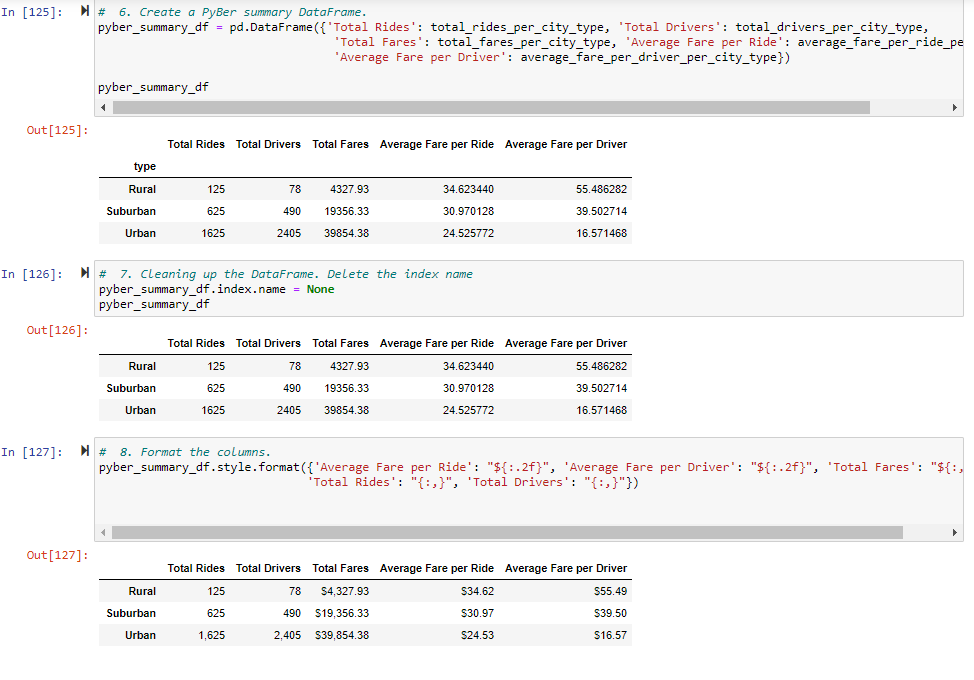
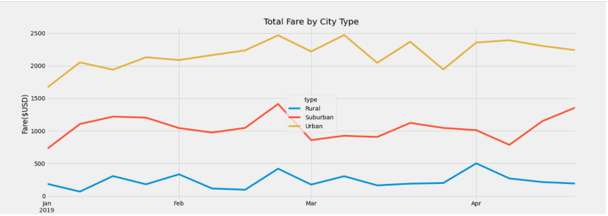

# PyBer_Analysis
Visualizing Ride Sharing Data
#Overview of the analysis

The purpose of the new analysis is to use Pandas and Matplotlib to create a multiple-line graph that shows the total weekly fares for each city type.

# Results

Description of the differences in ride-sharing data among the different city types. 

-For Urban Cities, the total rides was the highest, the total drivers was the highest, the total fares for this city type was the highest, the average fare per ride was the lowest and the average fare per driver was the lowest.

- For Suburban Cities, the total rides was the second highest, the total drivers was the second highest, the total fares for this city type was the second highest, the average fare per ride was the second highest and the average fare per driver was the second highest.

- For Rural Cities, the total rides was the lowest, the total drivers was the lowest, the total fares for this city type was the lowest, the average fare per ride was the highest and the average fare per driver was the highest.

**The following images show a summary and a multi-line chart of Pyber Data based on city type:**

# Summary

Three business recommendations to the CEO for addressing any disparities among the city types include:
- Winter time is not the best time for Pyber ride sharing in Rural areas. Increase the number of total drivers in Rural areas so fares can be cheaper leading to more accessibility.
- There are more drivers than the total rides in Urban areas. A suggestion would be to decrease the number of drivers in Urban areas.
- Increase the number of drivers in Suburban areas.
